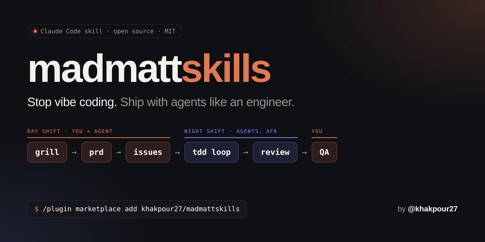

<div align="center">



# madmattskills

**Stop vibe coding. Start shipping with agents like an engineer.**

A drop-in Claude Code skill that turns a vague idea into reviewed, tested,
merged code: grill the idea, write the PRD, slice it into tracer-bullet
issues, let agents build them test-first while you're away, then review in a
fresh context.

[](#install)
[](LICENSE)
[](CHANGELOG.md)
[](https://github.com/khakpour27)

</div>

---

## Why this exists

AI agents write code fast. Left alone, they also write the wrong thing, in
big horizontal layers, with tests shaped to fit whatever they wrote, in a
context window that got dumb 80k tokens ago.

The fix isn't a bigger framework. It's the engineering fundamentals we
already know (Brooks, Fowler, Hunt & Thomas, Ousterhout), written down so an
agent follows them every time.

**madmattskills packages that discipline into one skill you install once
and use in every repo.**

## What you get

- 🔥 **Grilling before planning.** The agent interviews you one question at a
  time, each with a recommended answer, until you share the same design
  concept. Surfaces the questions nobody asked, like "do we backfill existing
  data?"
- 🎯 **A PRD that defines done.** User stories, a module map tied to real
  files, testing decisions, and an explicit out-of-scope list.
- 🧵 **Tracer-bullet issues.** Every task is a thin vertical slice through
  schema, service, API and UI that ends in something you can click. No more
  "Phase 1: database".
- 🗺️ **A kanban DAG, not a numbered plan.** Issues declare what blocks them,
  so independent work can run in parallel.
- 🌙 **AFK night shift.** A Ralph loop runs one issue per fresh session:
  failing test first, minimal code, refactor, tests + types + lint green,
  commit, stop.
- 🧠 **Smart-zone discipline.** Small tasks, fresh contexts, subagents for
  exploration. No endless compaction.
- 🧱 **Deep-module architecture review.** Finds clusters of shallow, tangled
  files and proposes simple interfaces with one wide test boundary.
- 🔍 **Fresh-context review.** Coding standards are pushed into a clean
  reviewer, not asked of a tired implementer.

## The workflow

```
   DAY SHIFT (you + agent)                          NIGHT SHIFT (agents)
 ┌────────┐   ┌──────┐   ┌────────────────┐     ┌──────────────┐   ┌──────────┐
 │ grill  │──►│ prd  │──►│ issues (DAG)   │────►│ afk TDD loop │──►│  review  │
 └────────┘   └──────┘   └────────────────┘     └──────────────┘   └────┬─────┘
      ▲                                                                 │
      └──────────── human QA: findings become new issues ◄──────────────┘
```

## Install

Install once, then use it everywhere.

**Claude Code plugin** (CLI, desktop and web):

```
/plugin marketplace add khakpour27/madmattskills
/plugin install madmattskills@madmattskills
```

**Personal skill** (gives the shorter `/madmattskills` command):

```bash
git clone https://github.com/khakpour27/madmattskills.git ~/code/madmattskills
~/code/madmattskills/install.sh     # symlinks into ~/.claude/skills; git pull to update
```

**For a whole team:** add this to the repo's `.claude/settings.json` and
everyone who opens the project gets it:

```json
{
  "extraKnownMarketplaces": {
    "madmattskills": { "source": { "source": "github", "repo": "khakpour27/madmattskills" } }
  },
  "enabledPlugins": { "madmattskills@madmattskills": true }
}
```

## Usage

| Command | What happens |
|---|---|
| `/madmattskills grill <brief>` | Interviews you until you and the agent share one design concept |
| `/madmattskills prd` | Writes the destination doc: stories, module map, tests, out of scope |
| `/madmattskills issues` | Splits the PRD into vertical-slice issues with `Blocked by` |
| `/madmattskills afk` | Builds one issue test-first, runs the feedback loops, commits |
| `/madmattskills architecture` | Finds shallow modules to deepen so the code is easier to test |
| `/madmattskills review` | Fresh-context review with your standards pushed in |

You don't have to type the mode. Say "grill me on this Slack message" or
"break this PRD into issues" and the skill loads itself.

(Installed as a plugin, the command is `/madmattskills:madmattskills`.)

### A typical feature, start to finish

```text
you   /madmattskills grill  "Retention is bad. Can we add gamification?"
agent Q1: What earns points? Recommendation: lesson + quiz completion only;
      skip video-watch events (noisy, gameable). ...
      Q7: Backfill points for existing progress records? Recommendation: yes, ...
you   /madmattskills prd
you   /madmattskills issues
agent 001 Award points for lesson completion, visible on dashboard  AFK  blocked by: none
      002 Streaks, visible on dashboard                             AFK  blocked by: 001
      003 Backfill existing progress                                AFK  blocked by: 001
you   ./scripts/ralph-afk.sh 10        # go get coffee
you   /madmattskills review            # then QA it yourself; findings become new issues
```

## The rules it enforces

1. Stay under ~100k tokens. Use a fresh session per issue.
2. Clear context instead of compacting it.
3. Align before you plan. Grill first.
4. Build vertical slices only, each ending in something demoable.
5. Use a kanban DAG, not numbered phases.
6. Red, green, refactor. Never write code before seeing a failing test.
7. Feedback loops set the ceiling on agent quality.
8. Build deep modules. Humans own the interfaces, agents own the internals.
9. Review in a fresh context with standards pushed in.
10. Humans own taste. QA turns into new issues.
11. Delete finished plans so they don't rot.
12. Own your stack. It's markdown and bash, so edit it.

## Security notes

- The AFK loop feeds issue text to an agent that edits files unattended. Only
  run it on issues you or trusted teammates wrote. Treat issues from strangers
  as untrusted input.
- Run it in a sandbox (container or throwaway worktree) with no production
  secrets, and review the diff before merging.
- Prefer `git clone` + `./install.sh` so you can read the installer before
  running it.

Found a security problem? See [SECURITY.md](SECURITY.md).

## What's inside

```
.claude-plugin/          marketplace + plugin manifests
skills/madmattskills/
  SKILL.md               core rules + mode router (small, always loaded)
  references/            per-mode playbooks, loaded only when needed
  templates/             PRD and issue templates
  scripts/               ralph-once.sh, ralph-afk.sh, ralph-prompt.md
docs/                    banner image and launch kit
install.sh               one-command personal install
SECURITY.md              how to report vulnerabilities
```

## Credits

Created and maintained by **[khakpour27](https://github.com/khakpour27)**.
See [CONTRIBUTORS.md](CONTRIBUTORS.md).

The workflow is based on Matt Pocock's workshop *Workflow for AI Coding* and
on the books it draws from: *The Design of Design* (Brooks), *Refactoring*
(Fowler), *The Pragmatic Programmer* (Hunt & Thomas) and *A Philosophy of
Software Design* (Ousterhout). This is an independent project, not
affiliated with or endorsed by Matt Pocock.

## Contributing

Issues and PRs are welcome. See [CONTRIBUTING.md](CONTRIBUTING.md).

If this saves you from one more "Phase 1: database" plan, **give it a ⭐**.
That's how other people find it.

## License

[MIT](LICENSE) © khakpour27
